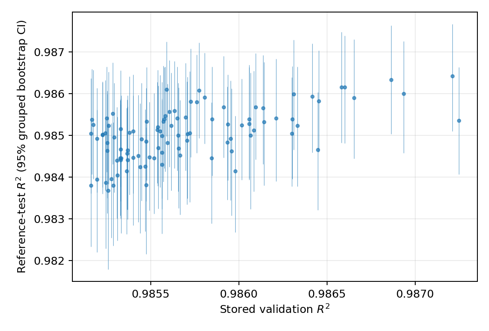
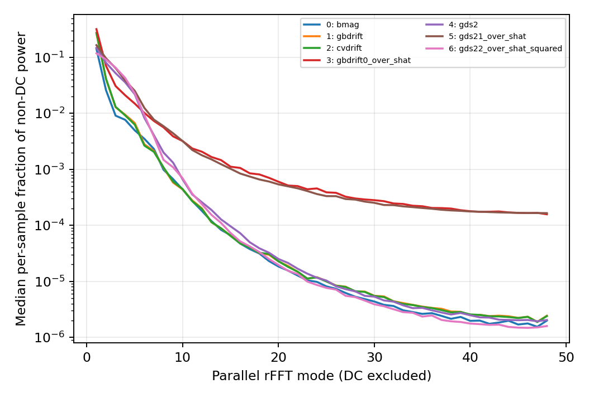

# S01 — Dataset, split, ensemble ranking, and cohort audit

## Status

Complete. This step freezes the reference cohort, member cohorts, and paired
interpretation panel. All model-performance quantities below concern the native
network output, `max(log Q, -2)`. No result is on `Q` or `exp(prediction)`, and no
perturbation or physical-causal claim is made.

The machine-readable cohort registry is
[`S01_artifacts/cohorts.json`](S01_artifacts/cohorts.json). The ignored production
run is `output/xai/S01/reference-audit-all100-panel2000/`; its `manifest.json`
hashes the external dataset, protected checkpoint, and every generated artifact.
This report includes the post-review rerun from code commit `d354d25`.

## Registered methods

The legacy split was reconstructed with seed 42 from the positive-flux samples
in the original concatenation order (fixed, then varied) and the original
80/10/remainder `torch.random_split`. Source samples have stable IDs of the form
`<gradient_set>:<zero-based HDF5 row_id>`.

All 100 members were evaluated separately on the varied-gradient reference-test
cohort. Residual means, quantiles, MSE, and R2 were retained for each member and
the ensemble mean. Results were stratified by stable/near-floor status
(`actual <= -1.9`), a separate five-level flux regime, `a/L_T` and `a/L_n`
tertiles, and equilibrium class. R2 at the exact clipped floor is undefined, so
MSE and bias are the meaningful stable-row metrics. Performance is also
stratified by the legacy split of each row's identical fixed-gradient twin and
by whether its equilibrium occurs in training.

Ranking uncertainty used 500 bootstrap resamples of the 8,113 distinct
`equilibrium_files`, never individual tubes. The stored-validation top 10 was
frozen before examining held-out results. The test re-ranking is diagnostic and
does not redefine the headline member cohort. Bootstrap top-10 membership always
has exactly ten members; ties are broken deterministically by stored member
order.

The interpretation panel contains 1,000 varied rows from 1,000 distinct
equilibrium files plus the same 1,000 geometry rows under the fixed-gradient
marker. Sampling reserved separate balanced diagnostic quotas for high absolute
error and high ensemble disagreement, then inverse-frequency sampled equilibrium class ×
flux regime × gradient-tertile cells. The panel was not tuned to an explanation
method.

Channel scales are median/MAD and IQR-based robust scales computed in float64 on
all reference rows and all 96 positions. The panel artifact retains pooled,
within-tube-centered, and between-tube-mean channel correlations separately. Its
Fourier summary is the median per-sample spectral shape after excluding DC and
normalizing each sample/channel by its non-DC power. It also retains `nfp`,
`iota`, `shat`, `d_pressure_d_s`,
`aspect`, `rho`, `aspect/rho`, `FSA_grad_xs`, `Q_stds`, `Q_avgs_vs_z`,
`Q_avgs_divided_by_FSA_grad_x`, and `zonal_phi2_amplitudes` for both gradient
sets. Signed member predictions are stored with `(member, sample)` axes.

## Reference performance

The varied reference cohort has exactly **9,785** rows. The all-member ensemble
reproduces the validated clipped-log score:

| Quantity | Result |
| --- | ---: |
| Ensemble R2 | 0.989310659282 |
| Registered reference R2 | 0.989310659379 |
| Absolute difference | 9.73e-11 |
| MSE | 0.0517594 |
| Bias (prediction - target) | +0.0053337 |
| Residual 1% / 50% / 99% | -0.6964 / +0.00155 / +0.6492 |

The ensemble MSE is 0.02326 on 3,170 stable/near-floor rows and 0.06542 on
6,615 unstable rows. Stable/near-floor bias is +0.03454, while unstable bias is
-0.00866. The very negative stable-status R2 (-877) is an expected denominator
pathology because that stratum is almost constant; it is retained in the table
rather than hidden. Performance varies more with drive regime than equilibrium
class: ensemble R2 is 0.9365 / 0.9792 / 0.9867 across `a/L_T` tertiles, while it
ranges from 0.9871 to 0.9931 across the five equilibrium classes.

Complete member and stratum tables are
[`member_performance.csv`](S01_artifacts/member_performance.csv) and
[`stratified_performance.csv`](S01_artifacts/stratified_performance.csv).

## Ranking uncertainty

Stored validation R2 and reference-test member R2 have Spearman correlation
**0.5653**. This is held-out at the tube/drive-instance level only: every
reference equilibrium occurs in training. None of the 500 grouped bootstrap
samples reproduced the stored-validation top-10 set exactly (estimated
probability 0); the zero-success binomial 95% upper bound is **0.00597**, not
1/500.

The stored-validation leader (`2864601_0.437`) falls to held-out rank 31 with
R2 0.985353, a 95% grouped-bootstrap R2 interval of [0.984070, 0.986634], and
only 0.042 bootstrap probability of entering the test top 10. Conversely,
stored rank 48 (`2864601_0.471`) is held-out rank 5 and enters the bootstrap top
10 with probability 0.708. The held-out leader is stored rank 2
(`2864601_0.371`), but even its bootstrap rank interval is 1–20. These broad,
overlapping intervals support treating validation rank as a covariate, not a
sharp quality boundary.



The full numerical ranking, intervals, and per-member top-10 probabilities are
in [`bootstrap_ranking.csv`](S01_artifacts/bootstrap_ranking.csv).

## Split leakage and bootstrap unit audit

Of 98,932 positive fixed/varied identity pairs, **33,520 (33.88%)** cross legacy
splits. The root HDF5 file stores geometry once, so a paired fixed and varied row
is exactly the same `raw_feature_tensor` row rather than merely a close match.
Among varied test rows, 8,791 of 9,785 have their fixed pair outside the test
split: 7,774 have it in training, 1,017 in validation, and 994 in test.

Equilibrium leakage is still broader: 19,571 of 23,577 equilibrium files appear
in multiple splits, 7,425 appear in all three, and 84.18% of all positive
fixed/varied samples belong to an equilibrium represented in more than one
split. Every varied reference-test row has its equilibrium file represented in
training, and 5,507 also have it represented in validation. The reported test
score therefore measures interpolation to held-out tubes/drive instances, not
held-out-equilibrium generalization.

Stratifying the ensemble score by the fixed twin's legacy split directly tests
whether identical-geometry exposure made these reference rows easier:

| Fixed twin split | Rows | R2 | MSE |
| --- | ---: | ---: | ---: |
| Train | 7,774 | 0.98930 | 0.05186 |
| Validation | 1,017 | 0.98644 | 0.06477 |
| Test | 994 | 0.99221 | 0.03769 |

There is no monotonic advantage for train-twin rows; the test-twin subset has
the best score. This null/inverted result argues against a simple claim that
identical fixed-geometry exposure alone inflates per-row accuracy. It does not
restore equilibrium-level generalization, because all 9,785 reference rows have
their equilibrium represented in training. The complete member-level leakage
strata are retained in
[`stratified_performance.csv`](S01_artifacts/stratified_performance.csv).

The reference cohort contains 9,785 tubes but 8,113 equilibrium files, so a tube
analysis inflates the nominal count of independent units by 1.206. Under perfect
within-equilibrium correlation the cluster-size design effect would be 1.418
(SE inflation 1.191). The empirical result for ensemble R2 is a useful negative
check: grouped-bootstrap SE is 0.000542 versus tube-bootstrap SE 0.000596, a
ratio of **0.910**, so tube resampling happens to be conservative for this one
metric. With 500 replicates, the approximate relative Monte Carlo error of one
bootstrap SE is 3.17%, and that of their ratio is 4.48%; the observed ratio is
therefore only about two Monte Carlo standard errors below one. That accidental
direction does not make tube resampling valid for other estimands; all
downstream uncertainty remains equilibrium-grouped.

## Frozen interpretation panel

The panel has 2,000 stable sample IDs: 1,000 varied rows and their 1,000 fixed
pairs, with one geometry row per equilibrium file. The varied half contains all
five equilibrium classes (counts 240, 199, 184, 154, 223), all gradient tertiles,
215 clipped-floor rows, 25 near-threshold rows, and 325 / 244 / 191 low / medium /
high unstable-flux rows. It includes 212 top-decile-error and 224
top-decile-disagreement rows; overlap is retained rather than forced away.

The fixed twins are **797 training, 107 validation, and 96 test** rows. Every
panel stable ID has its own `split` field in the cohort registry and in the
published [`panel_metadata.csv`](S01_artifacts/panel_metadata.csv). The narrow
near-threshold population is nearly exhausted: only 29 reference rows satisfy
`-2 < y <= -1.9`, and the panel contains 25 (86%). The frozen panel is unchanged,
but this stratum is explicitly **analysis-limited**: it is not a population
sample and cannot support an equilibrium-grouped bootstrap at n=25. Later
boundary analyses must widen a preregistered band or use a classification-style
estimand rather than claim supported inference from these 25 rows.

The member registry freezes these validation-only cohorts:

- stored-validation top 10;
- stored-validation ranks 11–50;
- stored-validation ranks 51–100;
- all 100 members; and
- the arithmetic ensemble mean of native member outputs.

The ignored `interpretation_panel.h5` retains the registered metadata and large
96-point arrays, including a split-code axis. The committed cohort JSON and
metadata CSV are sufficient to reconstruct and audit every sample from the
read-only canonical HDF5 file.

## Geometry audit and ground-truth invariant

Robust channel scales differ substantially: reference IQR-based sigmas range
from 0.190 for `bmag` to 1.639 for `gds2`, and maximum absolute values include
1,212 for `gds2`. Raw gradients across channels are therefore not comparable.
The registered scales are in
[`channel_robust_scales.csv`](S01_artifacts/channel_robust_scales.csv).
These measurements correct the preliminary `PLAN.md` scoping table: for example,
`gds2` has q99 23.15 and maximum 1,212 rather than 9.88 and 443, while channels
1–2 reach about 16.6 rather than 4.2. An independent full-data sample in the
review showed the same scale, so this is not a reference-cohort effect. The plan
now uses the registered S01 float64 measurements.



The spectrum above no longer lets DC or a few heavy-tailed tubes dominate: DC is
excluded, each sample/channel is normalized before aggregation, and the median
is shown. The ignored `panel_geometry_summary.h5` also distinguishes local
within-tube co-location (each tube/channel centered over z before pooling) from
correlation between tube-level channel means; the original pooled correlation is
retained as a labeled third quantity.

On all 100,705 geometries,

`mean_z(sqrt(channel_6)/channel_0) / mean_z(1/channel_0)`

matches `FSA_grad_xs` with relative L2 error **9.42e-8** and RMS relative error
9.24e-8. This passes the registered aggregate 1e-7 check, so
`log_FSA_grad_x` is registered as the ground-truth invariant feature for later
steps. The rowwise comparison is not perfectly uniform: three rows exceed
5e-7 relative error, and row 31,446 is an isolated 1.56e-5 outlier. It is retained
in `summary.json`; later analyses should use the authoritative stored
`FSA_grad_xs` value rather than silently replacing it with the reconstruction.
Direct inspection finds no degenerate geometry at row 31,446: all values are
finite, minimum `bmag` is 0.730, and minimum channel 6 is 0.208. The calculated
value is 1.4825408 versus stored 1.4825177, so the evidence points to an isolated
stored-value inconsistency rather than a singular input.

## Failed checks, negative results, and limits

- The pilot's five-member validation/test ordering was strongly unstable; the
  full run confirmed, rather than removed, this ranking uncertainty.
- Exact stored-top-10 reproduction was absent in 500 grouped resamples.
- Tube-level bootstrap was not overconfident for ensemble R2 in this cohort; the
  contrary empirical ratio and its Monte Carlo uncertainty are reported above.
- The full-dataset geometric identity has three rowwise precision outliers even
  though its aggregate relative error passes 1e-7.
- Stable-floor R2 is undefined. The 25-row panel near-threshold stratum nearly
  exhausts its 29-row reference population and is analysis-limited; MSE, bias,
  and separately registered classification-oriented analyses are required later.
- The original split has no held-out-equilibrium interpretation. S01 diagnoses
  this limitation but does not retrain or redefine the paper's reference score.
- Panel selection is equilibrium-grouped and covers registered regimes, but it
  is an interpretation panel, not a population-weighted estimator of prevalence.

## Reproduction and artifacts

Pilot, production, and resume commands:

```bash
.venv-xai/bin/python scripts/xai_s01_audit.py \
  --config configs/xai/S01_audit.json --pilot --no-publish

.venv-xai/bin/python scripts/xai_s01_audit.py \
  --config configs/xai/S01_audit.json

.venv-xai/bin/python scripts/xai_s01_audit.py \
  --config configs/xai/S01_audit.json --resume
```

The production manifest fingerprints the 678,040,404-byte dataset as SHA-256
`9d8fa52f93f2782ad9948a38bf46943c0cd6df78cd08b94a006dad4e06c1c8ad`
and the unchanged checkpoint as
`d5e092348514a5ee85b68bcdcf51dbb32eaa344beea1daa28f5aaeba9e86eefb`.
The run used Python 3.12.4, torch 2.4.1, numpy 1.26.4, h5py 3.11.0, Captum
0.9.0, CPU, and seed 20260816. The post-review production run took 308.5 s and
its manifest hashes all HDF5, CSV, JSON, and plot outputs. It identifies code
commit `d354d25` and tree `1bdc2fc`; `git_tracked_dirty` is false at manifest
capture (`git_dirty` is true only because the required ignored `output/` tree is
untracked). `--resume` now refuses cache reuse unless the manifest's dataset and
checkpoint SHA-256 values match, in addition to validating member and row IDs;
the reported final run recomputed predictions.

Verification commands:

```bash
conda run -n 20240629-01-ML python -m pytest
.venv-xai/bin/python -m pytest
git diff --check
```

Both test environments pass all 22 tests. The canonical external dataset and
`models/cyclic_ensemble_pre2.pt` were read only. Generated HDF5 arrays and the
existing user `output/` tree remain ignored and are not committed.

## Acceptance criteria

| Criterion | Evidence | Status |
| --- | --- | --- |
| Varied reference cohort has 9,785 rows | Exact split reconstruction and cohort registry | Pass |
| Validated ensemble R2 reproduced | Absolute difference 9.73e-11 | Pass |
| Stable IDs address all samples/members | Gradient-set row IDs, per-ID panel splits, immutable member lists | Pass |
| Fixed/varied and equilibrium leakage quantified | Pair matrix, equilibrium overlap, leakage-performance strata | Pass |
| Ranking uncertainty numerical | 500 grouped bootstraps, intervals, top-10 probabilities | Pass |
| Registered panel spans required regimes | 1,000 equilibria plus fixed pairs; counts above | Pass |
| Panel covariates and held-out diagnostics recorded | Labeled `interpretation_panel.h5` | Pass |
| Ground-truth invariant registered | Full-data relative L2 error 9.42e-8 | Pass |
| S01 permutation toy added | Joint-permutation invariance/control test | Pass |

## Review disposition

All 14 actionable findings in the external S01 review were accepted. No issue
was rejected. The narrow threshold band was handled by registering the frozen
stratum as analysis-limited rather than changing the panel after inspection; the
500-replicate bootstrap was retained with explicit Monte Carlo uncertainty and
the correct zero-success 95% upper bound rather than rerun at a memory-heavier
replicate count.
