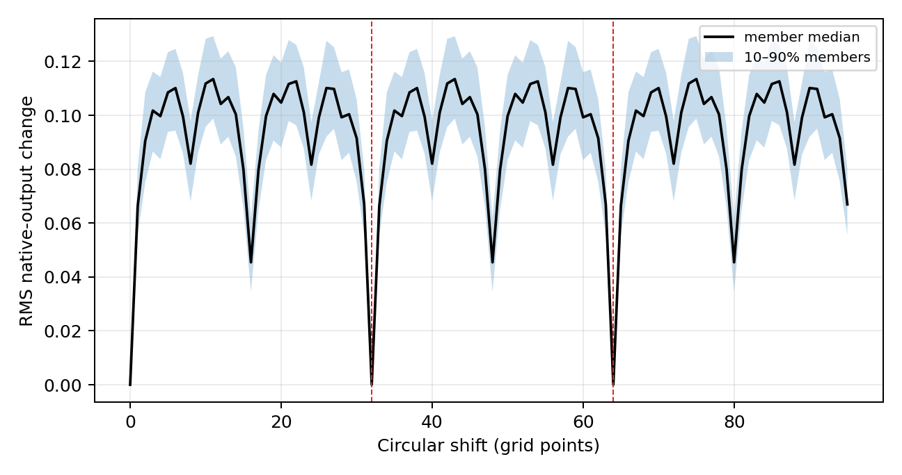
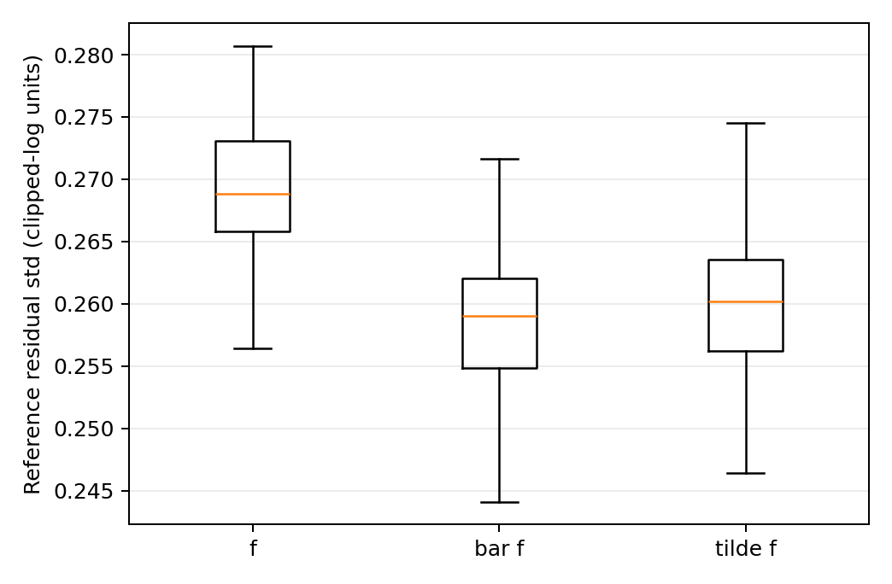

# S02 — Symmetry, the canonical invariant model, and the equivariant density

## Status and decision

Complete, including the external-review corrections. The researcher confirmed
**`invariant_tilde_f` (`tilde_f`) as the canonical model on 2026-08-16**.
`InvariantMember.forward()` now evaluates

`tilde_f_m(X, g_T, g_n) = MLP_m(mean_z rho_m(X), g_T, g_n)`.

Later position-resolved studies must report this exactly shift-invariant model
and the original member `f_m`, with their difference; they must not silently
substitute one for the other. The registered API also exposes the 32-phase
output average `bar_f_m`. Every result here concerns the native output
`max(log Q, -2)`, never `Q` or `exp(prediction)`.

The ignored production run is
`output/xai/S02/symmetry-all100-panel2000-reference9785/`. Its manifest hashes
the read-only external dataset, protected checkpoint, predictions, tables, and
figures. The compact machine-readable results are in
[`S02_artifacts/summary.json`](S02_artifacts/summary.json), with all published
tables in the same directory.

### Post-step correction, 2026-08-20

The fixed-gradient strata in
[`shift_symmetry_summary.csv`](S02_artifacts/shift_symmetry_summary.csv),
[`phase_average_exactness.csv`](S02_artifacts/phase_average_exactness.csv) and
[`parity_symmetry.csv`](S02_artifacts/parity_symmetry.csv) were recomputed
outside this step's numbered scope, after the shared loader was shown to be
supplying fixed rows at an `a/L_T` the checkpoint never saw. The original values
were measured with every member pinned at the clipped-log floor. Corrected
numbers appear in place below, each marked; the withdrawn values are quoted
beside them rather than deleted.

Nothing else in this step moves. The refresh recomputed only the fixed half of
the panel, read the varied half back from this step's registered
`predictions.h5`, and verified two things: re-predicting sampled varied members
reproduces the stored values with maximum absolute difference **0.0**, and
rebuilding all 1,782 committed varied rows through the same statistic builders
reproduces them with maximum absolute difference **0.0**. Accuracy, the
canonical decision, the density census and the bottleneck census are untouched —
the bottleneck is computed from geometry alone and never sees `a/L_T`. The run
is `output/xai/S03fix/s02-fixed-refresh-all100-panel1000/`; its manifest is
committed as
[`s02_fixed_refresh_manifest.json`](S03_fixed_gradient_artifacts/s02_fixed_refresh_manifest.json)
and the reasoning is in
[`S03_fixed_gradient_decision.md`](S03_fixed_gradient_decision.md).

External review found that the first implementation preserved `mean_z rho` but
rolled `rho`'s position axis for 91 architectures with even kernels. The à trous
padding convention is corrected and a new alignment check pins
`rho[..., ::32]` to the trained stride-32 pre-GAP map. Accuracy, `bar_f`,
`tilde_f`, and the canonical decision were unaffected because a circular roll
does not change `mean_z rho`; all position-resolved uses must use this corrected
version.

## Registered methods and cohorts

The shift analysis used all 100 members and every shift `S_k`, `k=0,...,95`, on
the frozen S01 interpretation panel: 1,000 varied-gradient rows from distinct
`equilibrium_files` and their 1,000 fixed-gradient twins. Signed predictions
were retained with member, sample, shift, and transform axes in the ignored
HDF5 artifact. Shift error is `f_m(S_k X)-f_m(X)`. Fixed and varied halves are
never pooled, and each is separated into all, stable/near-floor, and unstable
rows. On varied rows, RMS change is normalized by the same member's residual
standard deviation in the matching stratum of the full varied-gradient
reference cohort. Fixed rows retain absolute output changes but no cross-cohort
normalization.

Accuracy and cost were measured for `f_m`,
`bar_f_m = mean_{k=0,...,31} f_m(S_k X)`, and `tilde_f_m` on all 9,785 varied
reference rows. Results retain all members and separately report the 3,170
stable/near-floor rows (`target <= -1.9`) and 6,615 unstable rows. Paired
uncertainty resampled the 8,113 `equilibrium_files` 500 times, never individual
flux tubes.

The full-resolution density uses a stride-one à trous version of the trained
five-block convolution/max-pooling chain. At block `j`, both convolution and
two-point max pooling use dilation `2^(j-1)`, so all 32 pooling phases remain on
the 96-point grid. The resulting `(sample, bottleneck_unit, z)` tensor is
`rho_m`; its position mean is `bar_u_m`, the input to the unchanged trained MLP
head in `tilde_f_m`.

Parity is the exact diagnostic operator `P`: grid-anchored `z -> -z`, with sign
flips on channels 3 and 5. Plain reversal without those sign flips is the
matched wrong-parity control. Both are exact-symmetry diagnostics of the model,
but parity is only approximate in the observed data; its data mismatch is
therefore reported independently.

## Cyclic-shift symmetry

The pooling subgroup at shifts 0, 32, and 64 is invariant to a maximum absolute
member-output change of **1.33e-5**, passing the registered `atol=rtol=2e-5`
tolerance. Averaging all 96 shifts and the 32 distinct pooling phases agrees to
**9.54e-7** maximum absolute error. All later symmetrization therefore uses and
must be labeled as **32-phase**, not 96-phase.

Both figures are from the 2026-08-20 fixed-gradient refresh and replace 9.54e-6
and 1.07e-6. **Read the pass, not the digits.** These are maxima of float32
roundoff differences more than an order of magnitude below the registered
tolerance, and their exact values depend on the machine and the batching: an
independent recomputation on a GitHub runner reproduced the verdict but not the
values, and disagreed on which half of the panel carries the maximum. No trend
should be inferred from the change in either number.

What can be said without depending on those digits is that the check now tests
more than it did. Under the old convention half the panel sat pinned at the
clipped-log floor, where a nearly constant output is close to trivially
shift-invariant, so the subgroup criterion was partly vacuous on those rows; it
is now evaluated on fixed rows that actually respond, and it passes. The rows the
maxima are taken over — every entity, both gradient sets, all strata, shifts 32
and 64 — are published as
[`s02_subgroup_exactness.csv`](S03_fixed_gradient_artifacts/s02_subgroup_exactness.csv)
so the distributions can be compared across platforms instead of one scalar.

For non-subgroup shifts on the **varied panel**, the member/shift distribution
of RMS output change divided by each member's matching varied-reference
residual standard deviation has 10th/median/90th percentiles
**0.371 / 0.514 / 0.627**. Stable/near-floor rows are
**0.368 / 0.527 / 0.710**, and unstable rows are
**0.353 / 0.492 / 0.602**. The earlier mixed fixed+varied value of 0.366 is
withdrawn.

The fixed-gradient twins are somewhat less sensitive: their unnormalized RMS
change has 10th/median/90th percentiles **0.0607 / 0.0818 / 0.0979**, versus
**0.1002 / 0.1382 / 0.1681** for varied rows — a median ratio of **0.59**.
Within the fixed set the split by stability is large: stable/near-floor rows
(n = 23) give **0.0123 / 0.0269 / 0.0490** and unstable rows (n = 977) give
**0.0612 / 0.0826 / 0.0988**. No fixed-row ratio is formed using the
varied-reference denominator. This drive dependence is a reason the two gradient
sets are not pooled, though it is a factor of about two rather than the order of
magnitude reported before the correction.

The comparison is between unnormalized changes on row sets of different output
scale, and does not separate drive from scale: varied panel targets have mean
0.446 and standard deviation 2.044 with 21.5% at the floor, fixed panel targets
mean 2.005 and standard deviation 1.161 with 2.2%. Refusing the
varied-reference denominator on fixed rows is deliberate; the cost is that some
of the 0.59 may be scale.

> **Corrected 2026-08-20.** The figures above replace withdrawn ones
> (**0.00203 / 0.01167 / 0.02612**, a nominal ~12× gap) that were measured while
> the loader drove fixed rows to the off-manifold `a/L_T = -3`, where every
> member is pinned at the clipped-log floor. That was saturation wobble, not
> reduced sensitivity to geometry at constant drive. See
> [`S03_fixed_gradient_decision.md`](S03_fixed_gradient_decision.md). Varied-row
> results are unchanged and were never affected; the refresh reproduced every
> committed varied row exactly, to a maximum absolute difference of 0.0.

The committed
[`shift_symmetry_summary.csv`](S02_artifacts/shift_symmetry_summary.csv) contains
member quantiles, ensemble mean, and ensemble spread for every
gradient-set/flux stratum and shift. The manifest-hashed ignored run retains the
full signed per-member table as `shift_symmetry.csv.gz`.



The plot now shows the same normalized, varied/all estimand as the headline
text. Its repeated troughs are a real consequence of the five stride-two
pooling blocks, not evidence of continuous shift invariance. Exact subgroup
points are marked at 0, 32, and 64.

## Original and invariant model fidelity

All three ensemble functions remain highly accurate on the varied reference
cohort:

| Function | Ensemble R2, all | Ensemble residual std, all | Stable | Unstable |
| --- | ---: | ---: | ---: | ---: |
| `f` | 0.9893107 | 0.227456 | 0.148565 | 0.255641 |
| `bar_f` | 0.9893036 | 0.227529 | 0.148337 | 0.255805 |
| `tilde_f` | 0.9892924 | 0.227614 | 0.148469 | 0.256062 |

Member-level fidelity and timing are separate estimands:

| Function | Member residual-std median | Member range | Median member cost (us/sample) | Sequential 100-member cost (us/sample) |
| --- | ---: | ---: | ---: | ---: |
| `f` | 0.26885 | 0.25641–0.28071 | 316 | 39,607 |
| `bar_f` | 0.25902 | 0.23841–0.27605 | 8,945 | 1,116,445 |
| `tilde_f` | 0.26020 | 0.24078–0.27757 | 396 | 41,736 |

Stable-stratum R2 is retained in
[`accuracy.csv`](S02_artifacts/accuracy.csv) but is not interpretable because
that target is nearly constant; residual standard deviation and bias are the
useful summaries there. Median-member `tilde_f` costs 1.25 times `f`; the ratio
of summed sequential ensemble timings is 1.054. Explicit 32-phase `bar_f` costs
28.3 times `f` at the member median. Its timing batches eight phases together
(effective geometry batch 512) while `f` and `tilde_f` use batch 64, so these
ratios describe the registered implementations, not intrinsic operation counts.

The grouped bootstrap does not resolve an ensemble-accuracy difference. For
`tilde_f - f`, median delta R2 is -1.90e-5 with 95% interval
[-6.93e-5, +3.03e-5], and median delta residual standard deviation is +1.68e-4
with interval [-3.49e-4, +6.84e-4]. For `bar_f - f`, the corresponding values
are -8.27e-6 [-4.99e-5, +2.88e-5] and +8.61e-5
[-3.09e-4, +5.30e-4]. These intervals cross zero.

At member level, however, symmetrization improves the point-estimate residual
standard deviation for **all 100 members**. The 10th/median/90th member deltas are
-0.01372/-0.01013/-0.00656 for `bar_f - f` and
-0.01216/-0.00910/-0.00573 for `tilde_f - f`. In 500 paired
equilibrium-grouped resamples, all 100 `bar_f` member intervals and 98 of 100
`tilde_f` intervals have an upper 95% endpoint below zero. The minimum bootstrap
improvement probability is 0.992 for `bar_f` and 0.912 for `tilde_f`; the median
is 1.0 for both. Full intervals are in
[`member_grouped_bootstrap.csv`](S02_artifacts/member_grouped_bootstrap.csv).
The small opposite change in the ensemble mean is a negative result caused by
altered cancellation among member errors, not evidence that individual models
worsened.



The canonical choice is consequently structural rather than a claim of a
resolved ensemble accuracy gain: `tilde_f` is exactly invariant, exposes the
exact density identity below, improves every individual member, has no resolved
ensemble penalty, and is nearly as cheap as `f`.

## Equivariant density

Across all 100 members, the maximum discrepancy in
`mean_z rho_m(X) = bar_u_m(X)` is **1.91e-6**. The maximum discrepancy in
`rho_m(S_k X) = S_k rho_m(X)` is **2.86e-6**. Crucially, the new spatial-origin
check `rho_m(X)[..., ::32] = u_map_m(X)` agrees with the trained strided
pre-GAP map to **7.63e-6** maximum absolute error. All three checks pass the
registered float32 `atol=rtol=2e-5` criterion. The alignment check is necessary:
the mean and self-equivariance identities alone are unchanged by a global roll.

The corrected left padding is `dilation * floor((kernel_size - 1)/2)`, matching
the trained `padding="same"` convention on the coarser grid. Before correction,
91 of 100 members were rolled by 1–15 points, including every stored top-10
member; their means and therefore all fidelity results were unchanged. The
unit-level signed density is preserved before any averaging and is now the
verified primary position-resolved object for S05 and S07. Per-member errors are in
[`density_exactness.csv`](S02_artifacts/density_exactness.csv).

## Parity control

On all 9,785 varied-reference rows, observed data obey the declared parity to
numerical precision in channels 0, 1, 2, 4, and 6. The two parity-odd channels
are approximate: normalized mismatch MSE is **0.0419** for channel 3 and
**0.0793** for channel 5. The wrong plain-reversal control gives **3.958** and
**3.921**, respectively. Full channel results are in
[`parity_data_mismatch.csv`](S02_artifacts/parity_data_mismatch.csv).

The apparent disagreement with PLAN's preliminary 0.06–0.25 / 3.9–138 range is
resolved by the grid convention. `z -> -z` maps index `j` to `(-j) mod 96`, so
index 0 is fixed; a plain array `flip` introduces a one-cell offset and
manufactures mismatch in nominally even channels. The registered operator uses
the physical, grid-anchored modular reversal. This strengthens the control but
does not make the two odd channels exact.

For members on the varied panel, correct-parity RMS output change divided by the
matching varied-reference residual standard deviation has
10th/median/90th percentiles **0.191 / 0.225 / 0.263**; stable and unstable
medians are 0.214 and 0.216. The wrong control is much larger at
**1.592 / 1.792 / 2.010**. At ensemble level on varied rows, the correct
transformation changes the output by RMS 0.00994 (0.0437 residual standard
deviations), versus 0.3564 (1.567) for the wrong control. On fixed rows, correct
parity member RMS change has 10th/median/90th percentiles
**0.0429 / 0.0516 / 0.0640**, against **0.0519 / 0.0607 / 0.0708** for the same
unnormalized statistic on varied rows, and no varied-reference normalization is
applied. These too are the 2026-08-20 corrected values; the withdrawn
0.00067/0.00455/0.01009 were measured at the output floor.
Thus the trained functions strongly prefer the physical parity rule, but parity
is neither exact in the odd-channel data nor exact in predictions. The signed
member results and ensemble spread for every gradient/flux stratum are retained in
[`parity_symmetry.csv`](S02_artifacts/parity_symmetry.csv).

## Receptive fields and bottleneck census

[`receptive_fields.csv`](S02_artifacts/receptive_fields.csv) records the formal
span, left/right extents, half-grid center offset induced by even kernels,
periodic unique-position support, and global-connectivity flag for every member
after every block. Formal spans range from 3–17, 8–48, 20–105, 58–210, and
126–392 through blocks 1–5. No member is global after blocks 1–2; 3 are global
after block 3, 89 after block 4, and all 100 after block 5. Periodic unique
support, rather than an unwrapped formal span greater than 96, is the effective
structural receptive field.

The 100 bottlenecks have widths 7–32 (median 26). For canonical `tilde_f`, a dead
unit has maximum absolute `rho` on the S01 panel at most 1e-12; a near-dead unit
is non-dead but active on less than 1% of panel positions. There are **293 dead**
and **23 near-dead** `rho` units among 2,449 total units. For the co-reported
original `f`, applying the same definitions to the native pooled scalar `u`
gives **296 dead** and **6 near-dead** units. The top member has width 10 and one
dead unit under both definitions, matching the PLAN scoping check.

Spearman correlations with stored validation R2 are small: +0.0228 for width;
-0.1056/+0.0555 for `rho` dead/near-dead count; and
-0.1055/+0.1502 for native-`u` dead/near-dead count. The full signed activation
census, with stable unit IDs and quantiles for both functions, is in
[`bottleneck_units.csv`](S02_artifacts/bottleneck_units.csv).

## Failed checks, negative results, and limits

- The initial density implementation failed the subsequently added spatial-origin
  check for 91 members. It is corrected; mean, equivariance, and alignment now
  all pass. The original two checks were insufficient, not falsely evaluated.
- Native arbitrary-shift sensitivity is substantial at member level despite
  the pooling-subgroup exactness; ensemble averaging conceals most of it.
- Neither invariant construction has a statistically resolved ensemble-level
  accuracy advantage. The canonical decision must not be cited as such a gain.
- The fact that every member improves while the ensemble is marginally worse
  shows that member-error cancellation is changed by symmetrization. Signed
  member results must remain available downstream.
- Correct stellarator parity is much closer than the wrong control, but is
  approximate in both data and predictions; it is not a numerical null.
- The receptive-field table is structural support, not the gradient-magnitude
  distribution sometimes called an empirical effective receptive field.
- The S01 reference score is still interpolation at the equilibrium level:
  every reference equilibrium occurs in training. S02 does not repair that
  split limitation or make a physical-causal claim.
- Cost timings are CPU measurements from one run and are implementation and
  batch-size dependent; `bar_f` specifically benefits from phase batching.
- Fixed and varied predictions have sharply different symmetry sensitivity.
  The initial pooled headline is withdrawn and only within-gradient-set results
  are interpreted.

## Reproduction and artifacts

Pilot, production, and cached post-processing commands:

```bash
MPLCONFIGDIR=/private/tmp/mpl-s02 .venv-xai/bin/python \
  scripts/xai_s02_symmetry.py --config configs/xai/S02_symmetry.json \
  --pilot --no-publish

MPLCONFIGDIR=/private/tmp/mpl-s02 .venv-xai/bin/python \
  scripts/xai_s02_symmetry.py --config configs/xai/S02_symmetry.json

MPLCONFIGDIR=/private/tmp/mpl-s02 .venv-xai/bin/python \
  scripts/xai_s02_symmetry.py --config configs/xai/S02_symmetry.json --resume
```

The pilot used the top five members, 128 panel rows, and 128 reference rows; it
passed before the all-member run. The production computation used all 100
members, all 2,000 panel samples, all 9,785 reference rows, CPU, seed 20260816,
and about 5.20 wall-clock hours; the stored member timing components total 3.26
hours. Checkpointed predictions make the run resumable member by member. The
post-review pilot reran five members from scratch and passed in 22.1 s. The
all-member review pass reused only the unaffected prediction cache, recomputed
the corrected density/census and grouped statistics, and regenerated all small
artifacts in 199.5 s; no multi-hour rerun was needed. Resume still refuses data,
checkpoint, member, or row mismatches.

The manifest records Python 3.12.4, torch 2.4.1, numpy 1.26.4, h5py 3.11.0,
Captum 0.9.0, the 678,040,404-byte dataset SHA-256
`9d8fa52f93f2782ad9948a38bf46943c0cd6df78cd08b94a006dad4e06c1c8ad`,
and unchanged checkpoint SHA-256
`d5e092348514a5ee85b68bcdcf51dbb32eaa344beea1daa28f5aaeba9e86eefb`.
The final manifest identifies the reviewed code revision and a clean tracked
tree; `git_dirty` remains true only because the required untracked `output/`
tree exists. The canonical external dataset and
`models/cyclic_ensemble_pre2.pt` were read only. Large HDF5 output remains
uncommitted. The full stratified shift table is gzip-compressed in the ignored
run; only its compact summary is committed, while every member/shift row remains
manifest-hashed and reproducible.

Verification commands:

```bash
conda run -n 20240629-01-ML python -m pytest
.venv-xai/bin/python -m pytest
git diff --check
```

## Acceptance criteria

| Criterion | Evidence | Status |
| --- | --- | --- |
| All 96 shifts, all member/ensemble estimands | 100 members x 2,000 panel rows; signed member predictions retained | Pass |
| Exact subgroup verified | Maximum absolute change 1.33e-5 at shifts 0/32/64 | Pass |
| 32 phases replace 96 phases | Maximum average discrepancy 9.54e-7 | Pass |
| `f`, `bar_f`, and `tilde_f` registered | Public `InvariantMember` API; all-member fidelity/cost table | Pass |
| Fixed/varied and stable/unstable separate | Accuracy plus six shift/parity strata; no cross-cohort fixed normalization. Fixed strata recomputed 2026-08-20 at the corrected `a/L_T`; varied rows reproduced exactly | Pass |
| Grouped uncertainty | Ensemble and 100 member-level paired intervals from 500 resamples of 8,113 `equilibrium_files` | Pass |
| Full-resolution `rho` exactness | Mean 1.91e-6; equivariance 2.86e-6; spatial alignment 7.63e-6 | Pass |
| Data and model parity reported | Full varied reference plus six prediction strata and wrong-reversal control | Pass |
| Receptive fields cover every member/block | Formal and periodic support, asymmetry, and global flags | Pass |
| Bottleneck census covers all members | 2,449 stable unit IDs with signed statistics | Pass |
| Arbitrary shift error scaled fairly | Member error divided by own reference residual std | Pass |
| Canonical function fixed for later steps | Researcher-confirmed `invariant_tilde_f` | Pass |

## Review disposition

Findings 1–5, 7, and all presentation/hygiene subpoints in finding 8 were
accepted. They produced the density alignment fix and test; non-pooled
shift/parity strata; explicit member versus sequential-ensemble cost scopes;
member-level grouped intervals; full-reference parity measurement and grid
reconciliation; native-`u` census; normalized plotting; readable matrix
construction; compressed shift output; and the phase-batching caveat.

Finding 6 was accepted in part: `exact_rtol` is now actually applied together
with `exact_atol`, including all three density checks. The recommendation to
store float32 network predictions as float64 was rejected because it cannot add
precision. The checkpoint, model outputs, NumPy arrays, and HDF5 datasets are
all float32. A direct 64-row/top-member recomputation of shifts 0/32/64 was
bit-for-bit equal to the cached HDF5 values (maximum storage difference 0),
while its in-memory subgroup difference was 1.91e-6. Thus the observed tolerance
is float32 model arithmetic, not additional HDF5 quantization; casting those
same values to float64 would only append zero bits.

## Deferred

Nothing. All six S02 tasks and the registered production cohort were completed.
