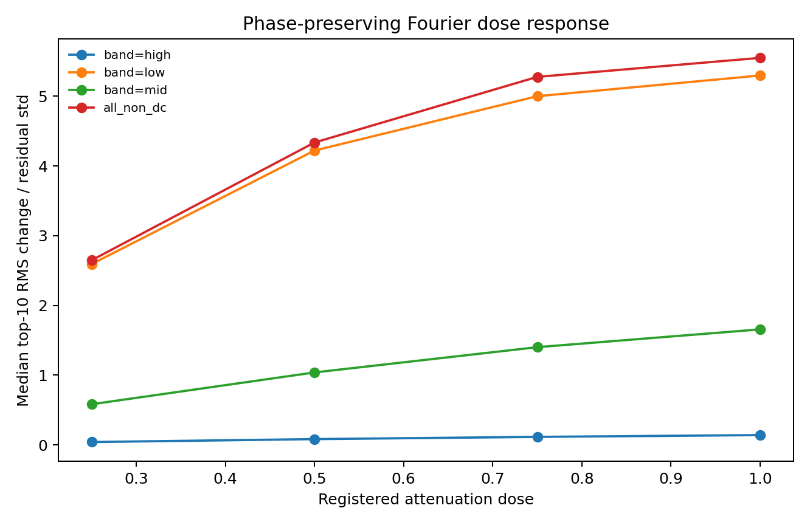

# S03 — The structure-destroying counterfactual ladder

## Status and headline result

Complete, including four external-review rounds. Every retained result explains the
trained native output `max(log Q, -2)`, never `Q` or `exp(prediction)`. The
primary estimand is S02's exactly shift-invariant canonical member function
`tilde_f_m = MLP_m(mean_z rho_m, a/L_T, a/L_n)`; the original `f_m` is retained
and compared. Member-level signed predictions and changes are preserved before
aggregation.

**Fixed-gradient results are withdrawn.** The shared loader supplies `a/L_T=-3`,
but the serialized training tensors contain nonnegative `a/L_T` only, and direct
inference shows that `-3` saturates the members at the clipped-log floor whereas
`+3` recovers R² of 0.978–0.985 for the tested top three. This registered-premise
conflict and the required cross-step correction are documented in
[`S03_fixed_gradient_decision.md`](S03_fixed_gradient_decision.md). Every number
interpreted below is from the 1,000-row varied-gradient panel.

The networks use substantially more than the multiset of pointwise
seven-channel vectors. On the frozen 1,000-row varied panel, random joint
permutation changes canonical top-10-member outputs by a median **3.26 panel
member residual standard deviations** (10th–90th member range 3.00–3.54).
This rejects a multiset-only description, but it does **not** isolate parallel
order: permutation also destroys the low-frequency envelope, and full low-band
attenuation is larger (3.85) at a smaller robust-scaled RMS dose (2.64 versus
5.20). High-band attenuation is only 0.099, so injected high-frequency power is
unlikely to explain the permutation response. Independent channel shifts give
2.41 (2.23–2.59) while preserving every channel's full profile and marginal
spectrum, cleanly establishing sensitivity to cross-channel alignment. The two
ordering/envelope mechanisms remain inseparable in this registered ladder.

The phase comparison was rerun with a genuinely matched random tensor: each
channel receives an independent random phase rotation, while the common endpoint
uses that same tensor's channel-0 rotation for every channel. Across three
replicates, common/per-channel effects are 2.771/3.298, 3.030/3.013, and
2.690/3.161 panel residual SD. Paired per-member channel-minus-common medians are
0.364/0.287/0.548, with 8/10, 6/10, and 9/10 members positive; the 10th member
percentile is negative in the first two replicates. Paired 1,000-draw
equilibrium bootstrap intervals for the median-across-member differences are
0.131–0.789, 0.051–0.609, and 0.353–0.791. These intervals address equilibrium
sampling within each phase draw, not Monte-Carlo uncertainty over phase draws.
With only the three preregistered phase realizations, the result remains
suggestive rather than a component-size or dominant-mechanism claim.

The original manifest-backed production run is
`output/xai/S03/ladder-top10-all100-varied1000-paired2000-reviewfix/`. It took
2,809 s (46.8 minutes) on CPU. The six corrected phase entries have a second
targeted production manifest at
`output/xai/S03/phase-matched-top10-all100-varied1000-review3b/manifest.json`.
The two run manifests hash their signed predictions, tables, endpoints,
checkpoint, dataset, configuration, and source fingerprints.
The committed generated headline table is
[`S03_artifacts/ladder_summary.csv`](S03_artifacts/ladder_summary.csv), with
machine-readable checks in [`S03_artifacts/summary.json`](S03_artifacts/summary.json).
Review-derived, source-hash-verified quantities are in
[`S03_artifacts/review2_summary.json`](S03_artifacts/review2_summary.json), and
registered paired control contrasts are in
[`S03_artifacts/contrasts.csv`](S03_artifacts/contrasts.csv).
[`S03_artifacts/review3_manifest.json`](S03_artifacts/review3_manifest.json)
verifies both source manifests, both signed-prediction files, the stored support
model, and hashes all nine other files in the published artifact directory. The
old full-run `--resume` command is intentionally no longer documented because
HEAD's source fingerprint differs; reproducibility now follows this explicit
two-manifest derivation rather than pretending the old cache is resumable.

## Registered cohort, functions, normalization, and uncertainty

The production cohort was the frozen S01 panel: 1,000 varied-gradient rows from
1,000 distinct `equilibrium_files` plus their 1,000 fixed-gradient twins. The
fixed outputs are retained only as an audit trail and are not interpreted. No
row or member was selected after seeing S03 results. The complete ladder was run for
the stored-validation top 10; 13 cheap entries were run for all 100 registered
members. Random operators have three fixed-seed replicates for the top 10, with
replicate zero covering all 100.

For varied rows, RMS output change is divided by the same member's residual
standard deviation measured on this same frozen panel and matching
function/stable/unstable stratum. The prior report divided panel numerators by
S02 full-reference denominators. Panel/S02 denominator ratios across the top 10
are 1.33–1.43 (median 1.39) overall, 1.65–1.84 (median 1.77) for stable rows, and
1.23–1.32 (median 1.29) for unstable rows, so all old normalized magnitudes are
withdrawn. The full table retains S02's denominator in a comparison-only column.
Fixed-row numerical interpretations are withdrawn for the separate
sign-convention reason above.

Top-10 intervals use 1,000 resamples of whole `equilibrium_files`, never flux
tubes. The panel contains one row per equilibrium in each gradient set. Each
bootstrap draw recomputes both the perturbation RMS numerator and the panel
residual-standard-deviation denominator, so denominator uncertainty is included.
Because RMS is nonnegative by construction, whether its interval excludes zero
is not an informative test. Instead, signed paired member contrasts compare each
operator to an informative comparison. Joint permutation exceeds independent shift
for all 10 members in all three replicates; paired difference medians are 0.883,
0.910, and 0.938 panel residual SD. Contrasts against random joint shift are
retained only as exact-symmetry diagnostics: because that control is null by
construction, they are not statistical or effect-size evidence. Full quantiles
are retained in `contrasts.csv`. Inferential paired contrasts now additionally
resample the same 1,000 equilibrium rows for treatment, control, reference, and
residual denominator, then take the median across the registered top 10. The
joint-permutation-minus-independent-shift intervals are 0.716–1.079,
0.744–1.069, and 0.726–1.109 across the three registered random replicates.

Parenthetical 10th–90th ranges in this report are explicitly **member spread**,
not sampling uncertainty. The compact table now also commits, for every headline
row, the median lower and upper endpoints of the ten member-level 95% grouped-
bootstrap intervals. For example, joint permutation is 3.26 with member spread
3.00–3.54, while the median member interval is 2.88–3.69.

Every edit reports input displacement after division by S01's registered
per-channel IQR/1.349 scales using both RMS and median absolute aggregation over
edited cells. Single-channel replacement uses only the edited channel. Neither
reduction is a canonical effect-size denominator: RMS is tail-sensitive, while
the median can ignore sparse but consequential edits. Normalized rankings are
therefore reported only as sensitivity analyses, never as headline rankings.
The compact table publishes both input-dose reductions for every family, while
tagging cross-family values `reported_not_cross_family_comparable`; it also
publishes the S02-reference-normalized output column alongside the panel-
normalized headline.

## Perturbation and baseline API

`itg_nn.xai.perturbations` provides validity-tagged deterministic operators and
the reusable baseline family required downstream:

- per-channel robust constant profiles using the pooled reference median;
- observed nearest-neighbour backgrounds matched on `(a/L_T, a/L_n)` within
  equilibrium class, plus observed medoids;
- periodic low-pass transforms applicable to analysed or background input;
- equilibrium-class/gradient-conditional channel profiles;
- hard wrapped windows with no truncation at index 0, tied to grid scales and
  every member's S02 receptive fields; and
- linear endpoint paths with support diagnostics at doses 0, 0.25, 0.5, 0.75,
  and 1.

An all-zero geometry is explicitly forbidden as a default. Every ladder row is
tagged `exact_symmetry`, `observed_comparison`,
`plausibly_local_not_guaranteed_physical`, or
`deliberately_off_manifold_diagnostic`. Structure-destroying edits and
single-channel replacements are deliberately off manifold: they explain the
network, not the plasma.

The production ladder exercises the exact-symmetry and deliberately-off-manifold
tags. The observed-comparison and plausibly-local tags belong to the reusable
baseline/window API required by task 1; PLAN task 3 does not register a network
intervention using them. Likewise, the wrapped-window acceptance test verifies
the API's periodic support contract, not a claim about a windowed member result.

Block permutations use a seeded random cyclic origin per sample, permute
contiguous blocks, and roll back. Identity and every cyclic rotation of the
block order are rejected, so every endpoint actually destroys block order
rather than reducing to an exact joint shift. Common phase scrambling multiplies
the original spectrum by a shared random unit complex number at each non-DC,
non-Nyquist frequency; independent scrambling rotates each channel by its own
phase from the same full random tensor. Both preserve each marginal amplitude
spectrum, while only the common rotation preserves relative cross-channel phase.
All seeded random operators now transform the 1,000 unique geometries once and
tile the endpoints, so registered varied/fixed twins receive bit-identical
realizations. The earlier production varied endpoints remain unchanged; only the
now-withdrawn fixed endpoints differed. On the same 64-row registered pilot,
every varied prediction was bit-identical before and after this change (maximum
absolute difference 0), while the fixed predictions changed as expected.

Only the conditional channel profile is exercised on real member inputs in S03.
Robust constants, matched observed rows/medoids, and low-pass baseline paths are
implemented and toy-tested API for their first downstream real-data consumers;
the registry no longer presents the nearest-neighbour selection underlying
`matched_observed` as a separate sixth family.

## Exact and near-exact controls

All exact controls pass S02's `atol=rtol=2e-5` standard. Across production,
maximum absolute errors are 9.54e-6 for original `f` under shift 32, 7.63e-6
for `tilde_f` under shift 32, and at most 7.63e-6 for `tilde_f` under arbitrary
per-sample joint shifts. Normalized top-10 canonical shift RMS is below 9e-7.
The corresponding arbitrary-shift effect for original `f` is **0.394 panel
residual SD** (top-10 median), a direct equivariance-error budget for S06. Thus a
position-resolved explanation of uncanonicalized `f` would inherit contamination
comparable to roughly two-fifths of the model's own panel error.

The near-exact stellarator parity changes canonical outputs by median 0.138
panel residual SD, whereas the matched wrong-parity reversal changes them by
1.26. The all-100 medians are 0.126 and 1.28, so this is not a top-10 accident.
Parity is not called a numerical null: S02 showed that channels 3 and 5 obey it
only approximately in observed data.

The larger structure tests agree across functions. Original `f` gives medians
3.16 for joint permutation and 2.35 for independent shifts, versus 3.26 and
2.41 for `tilde_f`. Matched common/per-channel phase values are 2.67/3.10 for
`f` and 2.77/3.30 for `tilde_f` in replicate zero.

## Permutation, co-location, and length scale

For canonical `tilde_f` on varied rows, replicate-zero top-10 and all-100
member distributions agree:

| Operator | Top-10 median (10%–90%) | All-100 median (10%–90%) |
| --- | ---: | ---: |
| Joint permutation | 3.26 (3.00–3.54) | 3.19 (2.86–3.55) |
| Independent channel shifts | 2.41 (2.23–2.59) | 2.25 (2.08–2.49) |
| Common relative-phase-preserving rotation | 2.77 (1.81–3.95) | 2.37 (1.69–3.54) |
| Per-channel phase rotation | 3.30 (2.40–4.33) | 2.79 (2.29–3.95) |

Joint permutation preserves every pointwise channel vector but changes both its
parallel order and its low-frequency envelope, directly rejecting a multiset-
only description without identifying which destroyed property drives the
response. Its robust-scaled RMS/median-absolute doses are 5.201/0.679, compared
with 5.115/0.678 for independent shifts; these nearly equal descriptive doses
are now committed in `ladder_summary.csv`, but are not treated as universal
cross-family effect denominators. Median signed
changes are -0.682 clipped-log units for joint permutation, -0.201 for
independent shifts, -0.060 for common phase rotation, and -0.237 for per-channel
scrambling. Signed member values remain in the full table.

With exact cyclic block orders excluded, the interpretable length-scale spectrum
has medians 2.93, 2.42, 1.83, and 1.26 panel residual SD for lengths 2, 4, 8,
and 16. Across three random replicates, the range of each member-median rung is at
most 0.070. The L=32 endpoint is **not** another generic spectrum rung: with
three blocks, rejecting the three cyclic rotations leaves only a reversal and
its rotations. Its 1.17 effect is therefore reported as a three-block reversal
control, consistent with the wrong-parity reversal effect of 1.26. The prior
claim that L=32 extended the monotone length-scale curve is withdrawn, as is the
older L=32 implementation that mixed in 46.1% exact-shift endpoints.

PLAN's scoping values were approximately 2.6 for joint permutation and 2.3 for
independent shifts on 256–2,000-row unstable varied slices. The frozen S01 panel
gives 3.26 and 2.41 on its own enriched-panel denominators; independent shifts
agree closely, while joint permutation is about 1.25× the scoping value. For the
top-ranked member on unstable original-`f` rows, raw changes are 1.243 and 0.920
clipped-log units, panel-normalized values 3.085 and 2.283, and S02-reference-
normalized values 4.129 and 3.055. The differences follow the registered panel's
error/disagreement enrichment, function/stratum choice, and denominator choice;
they are not an order-of-magnitude discrepancy signaling an operator bug.

## Spectral and channel ladders



Raw full-attenuation effects are 3.85, 1.22, and 0.099 panel residual SD for
low (bins 1–4), mid (5–16), and high (17–48) bands. The corresponding robust-
scaled RMS doses are 2.64, 2.59, and 0.371, giving sensitivities 1.46, 0.472,
and 0.268. But median-absolute doses are 0.438, 0.142, and 0.00971, giving
sensitivities 8.78, 8.62, and 10.25. Thus the earlier 3.1×/5.4× normalized
low-frequency multiplier is withdrawn: its magnitude and even the efficiency
ordering depend on how a heavy-tailed edit is reduced. The defensible result is
the raw finite-edit ordering, supported independently by the block ladder:
removing the low band changes the network much more than removing the mid or
high band. This also means the permutation result cannot separately establish
order dependence: destroying the low-frequency envelope is already sufficient
to cause a larger response. The tiny 0.099 high-band attenuation response argues
against injected high-frequency power as the permutation driver. Later
attribution should examine broad structure, but not because one dose
normalization establishes a universal efficiency rank.

Uniform attenuation of every non-DC amplitude is the registered control that
changes marginal power while preserving all relative phases. At doses
0.25/0.5/0.75/1 its top-10 effects are 1.898/3.118/3.908/4.016 panel residual SD,
with robust input RMS 0.930/1.859/2.789/3.719. Efficiency declines
2.041/1.677/1.401/1.080 across the path. The large full-dose response shows that
marginal spectral power alone matters substantially; the decreasing efficiency
again warns against treating these finite edits as a linear decomposition.

Conditional single-channel replacement exposes the reduction sensitivity
directly:

| Channel | Output effect | RMS dose | Effect/RMS | Median-abs dose | Effect/median |
| --- | ---: | ---: | ---: | ---: | ---: |
| `bmag` | 0.670 | 1.33 | 0.504 | 0.610 | 1.10 |
| `gbdrift` | 2.18 | 2.00 | 1.09 | 0.696 | 3.13 |
| `cvdrift` | 1.14 | 1.99 | 0.573 | 0.696 | 1.64 |
| `gbdrift0_over_shat` | 1.82 | 1.10 | 1.65 | 0.701 | 2.60 |
| `gds2` | 1.99 | 10.84 | 0.183 | 0.692 | 2.87 |
| `gds21_over_shat` | 1.27 | 2.33 | 0.547 | 0.784 | 1.62 |
| `gds22_over_shat_squared` | 2.02 | 2.06 | 0.976 | 0.660 | 3.05 |

The 9.8-fold RMS-dose spread collapses to 1.29-fold under median-absolute dose;
`gds2`'s top 1% cells dominate its RMS. Consequently both the withdrawn raw rank
and the former RMS-normalized rank are sensitivity views, not fair or unique
channel-importance estimates. Channel correlations, the channel-0/channel-6
target identity, heavy tails, and off-manifold paths preclude a causal ranking.
The heterogeneous family-pooled overview figure was removed; the parameter-
resolved table is the authoritative display.

## Drive dependence and support warnings

Stable/near-floor and unstable varied rows are never pooled. Top-10 canonical
medians for joint permutation are 0.996 panel residual SD on stable rows and
3.54 on unstable rows; independent shifts are 1.20 and 2.61; common phase
rotation is 1.28 and 2.97; per-channel phase rotation is 1.44 and 3.57. The
stable/unstable ratios are descriptive, not clean drive-effect estimates: both
the perturbation numerator and residual-standard-deviation denominator are
compressed near the clipped `-2` floor. Fixed
twins are not reported because their shared `a/L_T=-3` input saturates the
checkpoint rather than representing its trained constant-drive convention.

The support fit uses 1,536 equilibrium-unique reference rows and calibrates on
512 held-out equilibria. All 2,048 support/background equilibria are disjoint
from the panel; the old selection leaked 78 sibling tubes and is withdrawn.
Per-channel median/IQR scaling precedes an ordinary 24-component SVD PCA; the
scaling is robust but the PCA estimator and its leading components remain
sensitive to large `gds2` excursions. Cyclic phase is
anchored at the largest joint robust-standardized seven-channel excursion, so a
constant channel 0 cannot create a degenerate anchor.

The warning score is the maximum of two two-sided calibrated percentile scores.
Even for two independent calibrated uniforms its structural null median is
sqrt(0.5) = 0.707 and its fraction above 0.95 is 1 - 0.95² = 9.75%, not 5%.
The panel's unperturbed path-dose-zero median 0.719 and tail 11.4% are therefore
close to the structural null. Exact-shift tails are similarly 11.2%–11.3%.
Tail fractions, rather than raw warning medians, show the useful departures:
complete non-DC removal is 82.1% outside, full low-band attenuation 36.9%, and
full mid-band attenuation 26.5%.

The legacy combined warning still does not reliably identify ordering edits:
joint permutation has 10.5% outside and independent shifts 6.9%. The component
scores show that this is a summary-statistic failure, not evidence that PCA saw
nothing. From path dose zero to joint permutation, the median one-sided
reconstruction calibration percentile moves from 0.470 to **0.809**, while the
nearest-distance percentile moves only from 0.587 to 0.628. Folding the former
two-sided and then taking a maximum with the latter obscures that clean upper-
tail reconstruction shift; a heavy-tailed calibration also makes the central-
95% fraction insensitive. `support.csv` now publishes both one-sided component
percentiles at every path dose. Downstream S06 must inspect them separately;
low legacy warning values are not evidence of physical realizability.

## Toy controls, determinism, and reproducibility

The registered toy gate now runs before any real-member inference and covers all
12 operator families. The permutation toy is invariant to joint and block
permutations and joint shifts but changes under independent shifts. The
co-location toy is invariant to joint/block permutations, joint shifts, and the
correct common phase rotation (RMS 2.09e-8), while independent phase scrambling
changes it by 0.127. The Fourier toy's relevant-band effect is 24.0 versus
5.72e-6 for its high-band control; amplitude scaling changes it by 18.0. Parity
and reversal round trips are exact, replacement touches only its registered
channel, phase scrambling preserves amplitudes to 5.72e-6, and wrapped windows
retain constant support across index 0.

Every full-batch endpoint is generated twice before inference and compared
bit-for-bit, including channel replacement. Endpoint SHA-256 values are
separated into the retained 1,000-row varied half and the full paired batch in
[`S03_artifacts/operator_endpoint_hashes.json`](S03_artifacts/operator_endpoint_hashes.json).
Two independent fresh-process pilot runs produced byte-identical 46-entry
endpoint-hash JSON files and byte-identical prediction HDF5 files. Determinism is
therefore measured rather than asserted by a literal.
Regression tests additionally require every seeded random operator to give
bit-identical endpoints to registered twins and to reject malformed twin input.

The production manifest records Python 3.12.4, torch 2.4.1, numpy 1.26.4, h5py
3.11.0, and Captum 0.9.0. Dataset SHA-256 is
`9d8fa52f93f2782ad9948a38bf46943c0cd6df78cd08b94a006dad4e06c1c8ad`;
protected-checkpoint SHA-256 is
`d5e092348514a5ee85b68bcdcf51dbb32eaa344beea1daa28f5aaeba9e86eefb`.
Both were read only.

`predictions.h5` retains `(member, function, perturbation, sample)` axes with
signed native outputs. Resume validates dataset, checkpoint, row IDs, member
IDs, perturbation registry, config, cohort and robust-scale fingerprints, and
code hashes. The original full run and corrected phase run remain immutable.
`xai_s03_review2_artifacts.py` verifies their manifests and signed predictions,
replaces only the six phase ladder rows, deterministically regenerates robust
dose and support summaries, computes paired equilibrium bootstraps, and hashes
every other published artifact in `review3_manifest.json`. It also rebuilds
`summary.json` family medians and toy checks from the merged/corrected sources.
Regression tests enforce agreement between that summary and the compact ladder
and complete manifest coverage. No published JSON or CSV is hand-edited.

Pilot, fresh targeted phase reproduction, and artifact-derivation commands:

```bash
MPLCONFIGDIR=/private/tmp/mpl-s03 .venv-xai/bin/python \
  scripts/xai_s03_ladder.py --config configs/xai/S03_ladder.json \
  --pilot --no-publish \
  --output-dir output/xai/S03/pilot-review4-final

MPLCONFIGDIR=/private/tmp/mpl-s03 .venv-xai/bin/python \
  scripts/xai_s03_ladder.py --config configs/xai/S03_ladder.json \
  --families common_phase_scramble,channel_phase_scramble \
  --output-dir output/xai/S03/phase-matched-review3-reproduction \
  --no-publish

MPLCONFIGDIR=/private/tmp/mpl-s03 .venv-xai/bin/python \
  scripts/xai_s03_review2_artifacts.py \
  --source-run output/xai/S03/ladder-top10-all100-varied1000-paired2000-reviewfix \
  --phase-run output/xai/S03/phase-matched-top10-all100-varied1000-review3b
```

The pilot uses a deterministic proportional sample across equilibrium class ×
stable/unstable strata (64 varied rows plus fixed twins), not a sorted row-ID
prefix. It uses one member, two random replicates, and 200 grouped bootstrap
draws. The final fourth-review rerun completed all 46 perturbations and checks in 15.7
s; its manifest is
`output/xai/S03/pilot-review4-final/manifest.json`. Production uses
1,000 draws.

## External-review disposition

All 14 findings in `review_step03_01.md` were accepted; none was rejected.

1. Common phase now rotates the original complex spectrum; analytic cross-phase
   and co-location controls enforce the intended invariant.
2. Block permutations reject identity and all cyclic block rotations; L=32 was
   rerun on the full cohort.
3. Every ladder row gained robust input RMS; the third review later added a
   median-absolute sensitivity view and withdrew a unique normalized rank.
4. Channel replacement reports explicit dose columns; its initial RMS-normalized
   rank is retained only as a sensitivity analysis after the third review.
5. Headline denominators now come from the panel; the S02 reference value remains
   comparison-only, and bootstrap draws recompute the denominator.
6. Support/background selection excludes panel `equilibrium_files`, with a hard
   zero-overlap runtime assertion.
7. The expanded all-family toy gate runs before model inference.
8. The CLI generates and manifest-hashes `ladder_summary.csv`.
9. The two-sided support-tail column and prose are correctly named.
10. Full-batch repeats, endpoint hashes, and two fresh-process byte comparisons
    replace the hard-coded determinism assertion.
11. Support canonicalization uses joint standardized energy instead of channel
    0 alone; a constant-channel-0 shift-invariance test was added.
12. Production bootstrap resolution is 1,000, and denominator uncertainty is
    included in every varied-row interval.
13. Pilot row reduction is proportional class × stability sampling.
14. Run IDs now distinguish 1,000 varied from 2,000 paired total rows, and the
    baseline acceptance wording distinguishes API coverage from network use.

### Second review (`review_step03_02.md`)

Findings 1–10 and 13–15 were accepted. Findings 11 and 12 were rejected as
stated, with the following concrete evidence; defensive clarifications or checks
were still added.

1. Fixed-gradient interpretations are withdrawn; the serialized training-tensor
   and direct-inference evidence is in the decision memo.
2. L=32 is reclassified as a three-block reversal control and removed from the
   length-scale spectrum.
3. All phase replicates and paired member differences are now reported; the
   earlier negative conclusion is withdrawn.
4. Registered matched controls now produce explicit signed paired contrasts;
   the vacuous RMS-interval statement is removed.
5. The support structural null is corrected to median 0.707 and 9.75% tail.
6. Robust input RMS comparisons are limited to within Fourier or channel-
   replacement sections; the compact table blanks the cross-family dose cells.
7. Random operators apply the same realization to both registered twins, with
   regression coverage.
8. Original-`f` arbitrary-shift error (0.394 panel residual SD) is reported.
9. The non-DC amplitude-scaling control is quantified and interpreted.
10. The PLAN scoping magnitudes are reconciled by cohort, function/stratum, and
    denominator.
11. Rejected as an acceptance defect: S03 task 1 requires all four tags and the
    reusable baseline/window API, while task 3 enumerates the production ladder.
    It does not require a member intervention for every tag or API method. The
    report now states exactly which contracts are API/toy-only.
12. Rejected as a code defect: after reserving one row per stratum, proportional
    allocation uses `remaining <= sum(capacity)`. For `alpha < 1`, each floored
    positive-capacity allocation remains below its capacity and leftover units
    go to distinct positive fractional remainders; for `alpha = 1`, leftover is
    zero. Over-allocation is therefore impossible. A runtime capacity and exact-
    sum assertion was nevertheless added.
13. The varied residual is now branch-local rather than relying on mask order.
14. Conditional profiles now fail loudly on an empty eligible set. Fixed-row
    conditional-profile interpretations are withdrawn with all fixed results.
15. The CLI no longer publishes the full ignored `ladder.csv` under reports;
    that table remains only in the manifest-hashed run directory.

### Third review (`review_step03_03.md`)

Findings 1–6 and 8–14 were accepted. Finding 7 was initially rejected, but the
fourth review demonstrated that the rejection rationale was wrong; its corrected
disposition appears below.

1. The five derived published artifacts are now generated rather than
   hand-edited and hashed by `review3_manifest.json`, which verifies both the
   original full-run and corrected phase-run manifests. The stale full-run
   resume command was removed.
2. Input dose now carries robust-scaled RMS and median-absolute reductions. The
   RMS-normalized channel rank and Fourier multipliers are withdrawn; both
   reductions are reported as sensitivity analyses.
3. Common and per-channel phase edits now consume one full shared random phase
   tensor. The six affected registered entries were rerun for top 10/all 100 as
   originally scoped.
4. Random-joint-shift contrasts are labeled exact-symmetry diagnostics, not
   effect-size controls or statistical evidence.
5. The compact committed table now distinguishes member spread from uncertainty
   and includes the median endpoints of member-level grouped-bootstrap 95%
   intervals.
6. The heterogeneous family-pooled overview figure was removed in favor of the
   parameter-resolved table.
7. Initially rejected on an incorrect common-random-number rationale. Block
   lengths share a deterministic family seed, but block-count-dependent
   `randperm` calls make streams diverge after the first sample. The fourth
   review withdraws the variance-reduction claim; the empirical ≤0.070
   replicate range remains the evidence for rung stability. `dose` remains
   irrelevant to deterministic Fourier operators, and phase families retain
   their genuinely matched tensor.
8. Exact-symmetry gates now call `allclose` with both registered `atol` and
   `rtol`; maximum absolute error remains reported as a diagnostic.
9. `ScaledPCASupport` and the report now say robust scaling followed by ordinary
   SVD PCA, and document component sensitivity to `gds2` outliers. The old class
   name remains only as a compatibility alias.
10. The registry combines nearest-neighbour selection with `matched_observed`,
    states that low-pass accepts analysed or background input, and records which
    paths were API-only versus exercised on real S03 inputs.
11. Stable/unstable ratios now carry an explicit clipped-floor numerator and
    denominator caveat.
12. Compact expanded-cohort columns now report the actual selected member count
    and work under `--members` caps instead of silently requiring exactly 100.
13. The executive summary is corrected and committed.
14. The review-artifact script supports both direct execution and package import,
    with a regression test.

### Fourth review (`review_step03_04.md`)

All eight findings identified valid defects or ambiguities. Two suggested new
calculations were not adopted for the concrete scope reasons below; the
underlying interpretive/uncertainty issues were addressed.

1. `summary.json` now rebuilds family medians from the merged ladder and takes
   the current toy checks from the corrected phase run. Endpoint hashes separate
   the retained varied half from the withdrawn paired full batch and include the
   corrected phase endpoints. The derived manifest covers every other published
   file, and regression tests enforce median agreement and manifest coverage.
2. The permutation claim is softened: it rejects a multiset-only model but
   cannot separate order from low-band-envelope destruction. No post hoc
   spectrum-restoration control was added because it was not registered and its
   exact estimand would require a new design choice; instead the report elevates
   independent shifts as the clean alignment result and reconciles permutation
   with low/high attenuation quantitatively.
3. Registered inferential contrasts now have paired 1,000-draw equilibrium-file
   bootstrap intervals. The suggestion to add phase realizations after seeing
   the three registered draws was rejected as an adaptive expansion of the
   preregistered random-replicate design; the report explicitly treats
   Monte-Carlo uncertainty as unresolved and keeps the claim suggestive.
4. `support.csv` now publishes median one-sided reconstruction and nearest-
   distance calibration percentiles for every path point. The text corrects the
   diagnosis: two-sided folding/maximum aggregation and the tail-fraction
   summary mask the reconstruction shift.
5. The false common-random-number claim for block lengths is withdrawn in code
   and prose. Deterministic shared family seeding is retained without a variance-
   reduction interpretation.
6. `PLAN.md` now marks the `-3` fixed-input premise as contested. The decision
   memo states an explicit open question, recommendation, evidence, and refresh
   cost before S07/S13.
7. The compact ladder publishes dose numbers for all families with an explicit
   non-comparability scope tag and adds the S02-reference-normalized column.
8. The executive-summary transcript line was removed and the `.gitignore`
   comment corrected.

## Acceptance criteria

| Criterion | Evidence | Status |
| --- | --- | --- |
| Deterministic fixed-seed methods | Full-batch repeats, hashes, matched phase tensor, fresh pilot | Pass |
| Wrapped windows have no boundary artifact | Shifted wraparound support equality | Pass |
| Toy relevant features outrank controls | Pre-inference checks for all 12 families | Pass |
| Exact symmetries null within S02 tolerance | Maximum absolute error 9.54e-6 < 2e-5 | Pass |
| Every perturbation has a validity tag | Machine-readable tag on all 56 entries | Pass |
| Every retained varied endpoint strength has support | 56 entries × five path doses on the unique varied geometries | Pass |
| Top-10 full varied ladder | Both `f` and `tilde_f`, stable/unstable separately | Pass |
| Cheap entries cover all 100 members | 13 entries; signed member predictions retained | Pass |
| Baseline API avoids all-zero default | Five distinct API paths; real-data usage disclosed | Pass |
| Member-level grouped uncertainty | 1,000 equilibrium-file draws for effects and paired inferential contrasts | Pass |
| Committed conclusions reproduce from manifests | Two verified run manifests/prediction files plus complete derived-output manifest | Pass |

Verification commands:

```bash
conda run -n 20240629-01-ML python -m pytest
.venv-xai/bin/python -m pytest
git diff --check
```

## Deferred

The repository-wide fixed-gradient loader correction and refresh of affected
S00–S02 fixed artifacts are deliberately deferred to the explicit open decision
gate in `S03_fixed_gradient_decision.md`; no fixed result may be used downstream
until that decision is resolved. A post hoc spectrum-restored permutation and
additional random phase draws are also deferred as new experimental design,
rather than silently appended after observing the registered ladder. All
S03-local tasks, varied-panel calculations, and valid review corrections are
complete.
