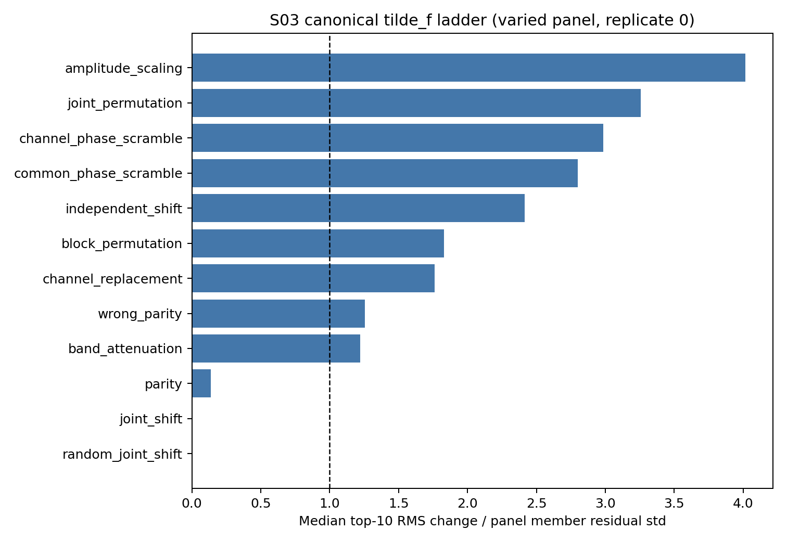

# S03 — The structure-destroying counterfactual ladder

## Status and headline result

Complete, including the external-review corrections. Every result explains the
trained native output `max(log Q, -2)`, never `Q` or `exp(prediction)`. The
primary estimand is S02's exactly shift-invariant canonical member function
`tilde_f_m = MLP_m(mean_z rho_m, a/L_T, a/L_n)`; the original `f_m` is retained
and compared. Member-level signed predictions and changes are preserved before
aggregation.

The networks use substantially more than the multiset of pointwise
seven-channel vectors. On the frozen 1,000-row varied panel, random joint
permutation changes canonical top-10-member outputs by a median **3.26 panel
member residual standard deviations** (10th–90th member range 3.00–3.54).
Independent channel shifts give 2.41 (2.23–2.59). These edits have similar robust
input displacement, so the result supports sensitivity to both parallel order
and cross-channel co-location, but the off-manifold probes do not form an
additive decomposition.

The corrected common-phase operator rotates each channel's existing Fourier
coefficient by the same random phase and therefore preserves cross-channel phase
differences. It changes canonical outputs by 2.80 panel residual SD, compared
with 2.98 when phases are randomized independently per channel. The earlier
4.47-versus-4.05 comparison was produced by an incorrect operator that replaced
every channel phase with a common value; it is withdrawn. The corrected modest
2.80-versus-2.98 difference does not support a claim that cross-channel phase
alignment carries most of the ordering signal.

The ignored corrected production run is
`output/xai/S03/ladder-top10-all100-varied1000-paired2000-reviewfix/`. It took
2,809 s (46.8 minutes) on CPU for the uncached inference pass. The final
post-commit cached validation pass refreshed the manifest from a clean tracked
tree without rerunning inference. The manifest hashes the full signed prediction
tensor, full member/function/stratum table, generated compact table, support
paths, figures, operator endpoints, protected checkpoint, and external dataset.
The committed generated headline table is
[`S03_artifacts/ladder_summary.csv`](S03_artifacts/ladder_summary.csv), with
machine-readable checks in [`S03_artifacts/summary.json`](S03_artifacts/summary.json).

## Registered cohort, functions, normalization, and uncertainty

The production cohort is the frozen S01 panel: 1,000 varied-gradient rows from
1,000 distinct `equilibrium_files` and their 1,000 fixed-gradient twins. No row
or member was selected after seeing S03 results. The complete ladder was run for
the stored-validation top 10; 13 cheap entries were run for all 100 registered
members. Random operators have three fixed-seed replicates for the top 10, with
replicate zero covering all 100.

For varied rows, RMS output change is divided by the same member's residual
standard deviation measured on this same frozen panel and matching
function/stable/unstable stratum. The prior report divided panel numerators by
S02 full-reference denominators. Panel/S02 denominator ratios across the top 10
are 1.33–1.43 (median 1.39) overall, 1.65–1.84 (median 1.77) for stable rows, and
1.23–1.32 (median 1.29) for unstable rows, so all old normalized magnitudes are
withdrawn. The full table retains S02's denominator in a comparison-only column.
Fixed rows remain in native clipped-log units without borrowing any varied-row
denominator.

Top-10 intervals use 1,000 resamples of whole `equilibrium_files`, never flux
tubes. The panel contains one row per equilibrium in each gradient set. Each
bootstrap draw recomputes both the perturbation RMS numerator and the panel
residual-standard-deviation denominator, so denominator uncertainty is included.
All ten joint-permutation and independent-shift intervals exclude zero; their
median widths are 0.838 and 0.630 panel residual SD.

Every edit also reports an input displacement after division by S01's registered
per-channel IQR/1.349 scales. The scalar dose is RMS over edited channels and
positions; single-channel replacement uses only the edited channel. This makes
spectral and channel comparisons explicit about unequal intervention size.

## Perturbation and baseline API

`itg_nn.xai.perturbations` provides validity-tagged deterministic operators and
the reusable baseline family required downstream:

- per-channel robust constant profiles using the pooled reference median;
- observed backgrounds matched on `(a/L_T, a/L_n)` within equilibrium class;
- nearest-neighbour and observed medoid backgrounds;
- input-specific periodic low-pass backgrounds;
- equilibrium-class/gradient-conditional channel profiles;
- hard wrapped windows with no truncation at index 0, tied to grid scales and
  every member's S02 receptive fields; and
- linear endpoint paths with support diagnostics at doses 0, 0.25, 0.5, 0.75,
  and 1.

An all-zero geometry is explicitly forbidden as a default. Every ladder row is
tagged `exact_symmetry`, `observed_comparison`,
`plausibly_local_not_guaranteed_physical`, or
`deliberately_off_manifold_diagnostic`. Structure-destroying edits and
single-channel replacements are deliberately off manifold: they explain the
network, not the plasma.

Block permutations use a seeded random cyclic origin per sample, permute
contiguous blocks, and roll back. Identity and every cyclic rotation of the
block order are rejected, so every endpoint actually destroys block order
rather than reducing to an exact joint shift. Common phase scrambling multiplies
the original spectrum by a shared random unit complex number at each non-DC,
non-Nyquist frequency; independent scrambling replaces each channel's phase
separately. Both preserve each marginal amplitude spectrum, while only the
common rotation preserves relative cross-channel phase.

## Exact and near-exact controls

All exact controls pass S02's `atol=rtol=2e-5` standard. Across production,
maximum absolute errors are 9.54e-6 for original `f` under shift 32, 7.63e-6
for `tilde_f` under shift 32, and at most 7.63e-6 for `tilde_f` under arbitrary
per-sample joint shifts. Normalized top-10 canonical shift RMS is below 9e-7.

The near-exact stellarator parity changes canonical outputs by median 0.138
panel residual SD, whereas the matched wrong-parity reversal changes them by
1.26. The all-100 medians are 0.126 and 1.28, so this is not a top-10 accident.
Parity is not called a numerical null: S02 showed that channels 3 and 5 obey it
only approximately in observed data.

The larger structure tests agree across functions. Original `f` gives medians
3.16 for joint permutation and 2.35 for independent shifts, versus 3.26 and
2.41 for `tilde_f`. Corrected common/per-channel phase values are 2.85/3.04 for
`f` and 2.80/2.98 for `tilde_f`.

## Ordering, co-location, and length scale

For canonical `tilde_f` on varied rows, replicate-zero top-10 and all-100
member distributions agree:

| Operator | Top-10 median (10%–90%) | All-100 median (10%–90%) | Robust input RMS |
| --- | ---: | ---: | ---: |
| Joint permutation | 3.26 (3.00–3.54) | 3.19 (2.86–3.55) | 5.20 |
| Independent channel shifts | 2.41 (2.23–2.59) | 2.25 (2.08–2.49) | 5.12 |
| Common relative-phase-preserving rotation | 2.80 (1.93–4.74) | 2.36 (1.73–3.56) | 5.47 |
| Per-channel phase scramble | 2.98 (2.32–4.88) | 2.69 (2.28–3.73) | 5.42 |

Joint permutation preserves every pointwise channel vector but destroys its
parallel order, directly rejecting a multiset-only description. Median signed
changes are -0.682 clipped-log units for joint permutation, -0.201 for
independent shifts, -0.050 for common phase rotation, and -0.228 for per-channel
scrambling. Signed member values remain in the full table.

With exact cyclic block orders excluded, wrapped block-permutation medians are
2.93, 2.42, 1.83, 1.26, and 1.17 panel residual SD for lengths 2, 4, 8, 16, and
32. Across three random replicates, the range of each member-median rung is at
most 0.070. The curve remains monotone: preserving progressively longer local
runs reduces damage, while genuinely reordering three length-32 blocks remains
slightly above the panel error scale. The old L=32 value mixed in 46.1% exact
shift endpoints and is withdrawn.

## Spectral and channel ladders


Raw full-attenuation effects are 3.85, 1.22, and 0.099 panel residual SD for
low (bins 1–4), mid (5–16), and high (17–48) bands. Those edits remove unequal
robust input RMS of 2.64, 2.59, and 0.371. Effect per robust input RMS is therefore
1.46, 0.472, and 0.268. The low band remains 3.1 times more effective than the
mid band and 5.4 times more effective than the high band after explicit dose
normalization; unlike the old raw ranking, this supports prioritizing low
frequency in later attribution work.

The conclusion is consistent across doses. At doses 0.25/0.5/0.75/1, low-band
effect per robust input RMS is 2.81/2.28/1.84/1.46, mid is
0.649/0.583/0.518/0.472, and high is 0.309/0.324/0.297/0.268. Declining efficiency
with dose shows nonlinearity and is retained rather than summarized as a single
linear sensitivity.

Conditional single-channel replacement gives a different ranking once actual
edit size is shown:

| Channel | Output RMS / panel residual SD | Input displacement (robust RMS) | Effect per robust input RMS |
| --- | ---: | ---: | ---: |
| `gbdrift0_over_shat` | 1.82 | 1.10 | 1.65 |
| `gbdrift` | 2.18 | 2.00 | 1.09 |
| `gds22_over_shat_squared` | 2.02 | 2.06 | 0.976 |
| `cvdrift` | 1.14 | 1.99 | 0.573 |
| `gds21_over_shat` | 1.27 | 2.33 | 0.547 |
| `bmag` | 0.670 | 1.33 | 0.504 |
| `gds2` | 1.99 | 10.84 | 0.183 |

Displacements span 9.8-fold, so the old raw-output ranking was not a fair
cross-channel comparison and is withdrawn. Even the normalized result is only a
coarse prioritization diagnostic: channel correlations, the channel-0/channel-6
target identity, and off-manifold replacement paths prevent causal or
independent-channel interpretation.



## Drive dependence and support warnings

Stable/near-floor and unstable varied rows are never pooled. Top-10 canonical
medians for joint permutation are 0.996 panel residual SD on stable rows and
3.54 on unstable rows; independent shifts are 1.20 and 2.61; common phase
rotation is 1.31 and 3.01; per-channel phase scrambling is 1.72 and 3.19. Fixed
twins are reported in absolute units: 0.0212, 0.0286, 0.146, and 0.0590 for those
four operators. No fixed/varied ratio is formed.

The support fit uses 1,536 equilibrium-unique reference rows and calibrates on
512 held-out equilibria. All 2,048 support/background equilibria are disjoint
from the panel; the old selection leaked 78 sibling tubes and is withdrawn.
Per-channel median/IQR scaling precedes a 24-component PCA. Cyclic phase is
anchored at the largest joint robust-standardized seven-channel excursion, so a
constant channel 0 cannot create a degenerate anchor.

The warning score is explicitly two-sided. `warning_score > 0.95` means either
calibrated percentile is below 0.025 or above 0.975, so the published column is
`fraction_outside_heldout_central_95pct`. The panel's unperturbed path-dose-zero
rate is 11.4%, not the nominal held-out 5%, because the enriched panel is not the
held-out calibration sample. Exact-shift endpoints are similar at 11.2%–11.3%.
Complete non-DC removal is strongly warned (median 1.0; 82.1% outside), as are
full low-band (0.885; 36.9%) and mid-band attenuation (0.809; 26.5%).

An important negative check remains: this coarse PCA warning does not reliably
identify ordering edits. Joint permutation has 10.5% outside and independent
shifts 6.9%. Low warning values are not evidence of physical realizability.

## Toy controls, determinism, and reproducibility

The registered toy gate now runs before any real-member inference and covers all
12 operator families. The permutation toy is invariant to joint and block
permutations and joint shifts but changes under independent shifts. The
co-location toy is invariant to joint/block permutations, joint shifts, and the
correct common phase rotation (RMS 1.78e-8), while independent phase scrambling
changes it by 0.142. The Fourier toy's relevant-band effect is 24.0 versus
5.72e-6 for its high-band control; amplitude scaling changes it by 18.0. Parity
and reversal round trips are exact, replacement touches only its registered
channel, phase scrambling preserves amplitudes to 3.81e-6, and wrapped windows
retain constant support across index 0.

Every full-batch production endpoint is generated twice before inference and
compared bit-for-bit, including channel replacement. Endpoint SHA-256 values are
manifest-hashed in
[`S03_artifacts/operator_endpoint_hashes.json`](S03_artifacts/operator_endpoint_hashes.json).
Two independent fresh-process pilot runs produced byte-identical 46-entry
endpoint-hash JSON files and byte-identical prediction HDF5 files. Determinism is
therefore measured rather than asserted by a literal.

The production manifest records Python 3.12.4, torch 2.4.1, numpy 1.26.4, h5py
3.11.0, and Captum 0.9.0. Dataset SHA-256 is
`9d8fa52f93f2782ad9948a38bf46943c0cd6df78cd08b94a006dad4e06c1c8ad`;
protected-checkpoint SHA-256 is
`d5e092348514a5ee85b68bcdcf51dbb32eaa344beea1daa28f5aaeba9e86eefb`.
Both were read only.

`predictions.h5` retains `(member, function, perturbation, sample)` axes with
signed native outputs. Resume validates dataset, checkpoint, row IDs, member
IDs, perturbation registry, config, cohort and robust-scale fingerprints, and
code hashes. `ladder_summary.csv` is generated from `ladder.csv` by the
registered CLI and both are manifest-hashed; only the compact table is committed.

Pilot, production, and resume commands:

```bash
MPLCONFIGDIR=/private/tmp/mpl-s03 .venv-xai/bin/python \
  scripts/xai_s03_ladder.py --config configs/xai/S03_ladder.json \
  --pilot --no-publish

MPLCONFIGDIR=/private/tmp/mpl-s03 .venv-xai/bin/python \
  scripts/xai_s03_ladder.py --config configs/xai/S03_ladder.json

MPLCONFIGDIR=/private/tmp/mpl-s03 .venv-xai/bin/python \
  scripts/xai_s03_ladder.py --config configs/xai/S03_ladder.json --resume
```

The pilot uses a deterministic proportional sample across equilibrium class ×
stable/unstable strata (64 varied rows plus fixed twins), not a sorted row-ID
prefix. It uses one member, two random replicates, and 200 grouped bootstrap
draws. Production uses 1,000 draws.

## External-review disposition

All 14 findings in `review_step03_01.md` were accepted; none was rejected.

1. Common phase now rotates the original complex spectrum; analytic cross-phase
   and co-location controls enforce the intended invariant.
2. Block permutations reject identity and all cyclic block rotations; L=32 was
   rerun on the full cohort.
3. Every ladder row now carries robust input RMS and effect per robust input RMS;
   the spectral conclusion was re-derived on that axis.
4. Channel replacement reports the same robust dose columns and the report ranks
   dose-normalized effects.
5. Headline denominators now come from the panel; the S02 reference value remains
   comparison-only, and bootstrap draws recompute the denominator.
6. Support/background selection excludes panel `equilibrium_files`, with a hard
   zero-overlap runtime assertion.
7. The expanded all-family toy gate runs before model inference.
8. The CLI generates and manifest-hashes `ladder_summary.csv`.
9. The two-sided support-tail column and prose are correctly named.
10. Full-batch repeats, endpoint hashes, and two fresh-process byte comparisons
    replace the hard-coded determinism assertion.
11. Support canonicalization uses joint standardized energy instead of channel
    0 alone; a constant-channel-0 shift-invariance test was added.
12. Production bootstrap resolution is 1,000, and denominator uncertainty is
    included in every varied-row interval.
13. Pilot row reduction is proportional class × stability sampling.
14. Run IDs now distinguish 1,000 varied from 2,000 paired total rows, and the
    baseline acceptance wording distinguishes API coverage from network use.

## Acceptance criteria

| Criterion | Evidence | Status |
| --- | --- | --- |
| Deterministic fixed-seed methods | Full-batch repeats, hashes, two byte-identical fresh pilots | Pass |
| Wrapped windows have no boundary artifact | Shifted wraparound support equality | Pass |
| Toy relevant features outrank controls | Pre-inference checks for all 12 families | Pass |
| Exact symmetries null within S02 tolerance | Maximum absolute error 9.54e-6 < 2e-5 | Pass |
| Every perturbation has a validity tag | Machine-readable tag on all 56 entries | Pass |
| Every strength has a support number | 56 entries × five path doses | Pass |
| Top-10 full ladder | Both `f` and `tilde_f`, fixed/varied and flux strata | Pass |
| Cheap entries cover all 100 members | 13 entries; signed member predictions retained | Pass |
| Baseline API avoids all-zero default | Six registered API families; conditional profile used in-network here | Pass |
| Member-level grouped uncertainty | 1,000 equilibrium-file draws with joint denominator resampling | Pass |

Verification commands:

```bash
conda run -n 20240629-01-ML python -m pytest
.venv-xai/bin/python -m pytest
git diff --check
```

## Deferred

Nothing. All five S03 tasks, the full registered panel, the top-10 ladder, the
all-100 cheap entries, and every valid external-review correction were completed.
