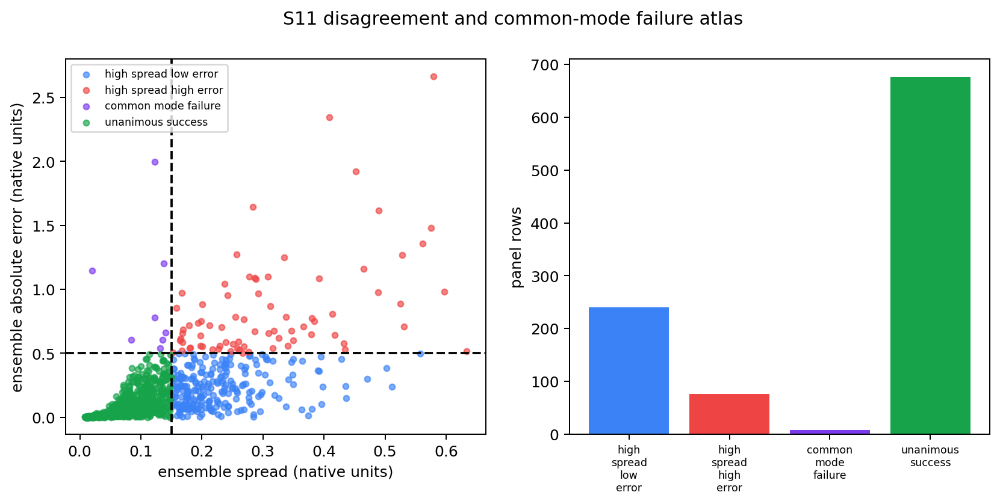

# S11 executive summary — When the networks disagree, and when they fail together

## What this step asked

The ensemble contains 100 trained neural networks. They usually make similar
predictions, but not identical ones. This step asked two related questions:

1. What geometric inputs make the networks disagree?
2. Does disagreement reliably warn us when their average prediction is wrong?

Every result is in the model's native quantity, \(\max(\log Q,-2)\). Nothing was
converted to \(Q\), so small and large effects are measured on the same scale
the networks were trained to predict.

“Ensemble spread” means the standard deviation of the 100 network predictions:
a number describing how far the networks are from one another. It is **not** a
confidence interval and does not say that the true GX value has a stated
probability of lying in some range. All networks were trained on the same data
and share the same broad architecture, so their agreement can be shared bias as
well as shared knowledge.

## Main conclusion

Disagreement is structured and ranks prediction error fairly well, but it is not
a calibrated estimate of that error.

On the frozen 1,000-equilibrium panel, median ensemble spread was **0.105 native
units** and median absolute prediction error was **0.094**. Their rank
correlation is **0.761** overall: rows with more disagreement usually have more
error. It is **0.829** on stable/near-floor rows but only **0.575** on unstable
rows. A separate held-out linear diagnostic explained **42.5%** of the row-to-row
variation in disagreement, but only **9.7%** of the variation in actual error.
“Held out” means whole
equilibria were kept away from model fitting and used only for evaluation, which
prevents near-duplicate tubes from making the score look better than it is.
On this panel each equilibrium contributes exactly one flux tube, so grouping is
a safeguard for the method rather than a numerical correction to these scores.

The practical lesson is asymmetric:

- Large spread tells us the networks are using the input differently, but it
  often occurs even when their average prediction is good.
- Small spread is reassuring most of the time, but it cannot guarantee success,
  because the networks can share the same mistake.

So spread is useful for ranking cases for attention, but its numerical value
should not be read as an error bar.

## Shared failures exist

Before running the experiment, “high error” was fixed at 0.5 native units and
“high spread” at 0.15. Under those transparent thresholds:

- **240** rows had high spread but low error;
- **76** had high spread and high error;
- **8** had low spread but high error; and
- **676** had both low spread and low error.

The eight low-spread/high-error rows are called **common-mode failures**: the
networks agree with one another but are jointly wrong. Two are stable or near
the model's floor value and six are unstable. Their existence is the clearest
reason not to call ensemble spread a confidence interval.

The exact count depends on the chosen cutoffs: changing both fixed thresholds
by ±20% gives between **2 and 34** common-mode rows. This sensitivity changes
the count, not the conclusion that shared failures exist.

## What was associated with disagreement

The strongest diagnostic was how much the original, unsymmetrized network
changes under a circular shift of the parallel coordinate. This change should
be physically irrelevant, and the canonical model used for explanations removes
it exactly. The feature fixed before the run averages the ten signed network
changes before taking their magnitude; opposite changes can therefore cancel.
Its rank correlations are **0.617** with spread and **0.482** with error. Keeping
each network's signed change and averaging their magnitudes instead gives
stronger correlations, **0.801** and **0.622**. This correction is important:
ensemble averaging had hidden some member-level symmetry failure. A rank
correlation is a measure of whether two quantities tend to rise together,
without assuming a straight-line relationship.

This is a warning flag, not a causal explanation. It may identify geometries
that are simply harder for the trained architecture. As a control, shifting the
canonical model changes its ensemble spread by only **2.1e-8 native units**,
effectively numerical zero.

The variation of the GX simulation in time, recorded as `Q_stds`, gives a mixed
result. For stable or near-floor cases, more simulation variability goes with
more network disagreement. For unstable cases, the association reverses sign.
This contradiction means we should not summarize `Q_stds` as a universal noise
explanation for ensemble spread.

The networks' **concept-selective activations**—internal responses aligned with
the full registered vocabulary of physical geometry concepts—show a modest
relationship with spread (rank correlation **0.241**) but little relationship
with actual error (**0.089**). Across all rows, disagreement among S10's eight
matched motifs in the top 10 networks is essentially unrelated to either
outcome. On unstable rows alone, however, it has small positive associations
with spread (**0.128**) and error (**0.085**). These exploratory results have
not been adjusted for testing many relationships. A motif is a group of hidden
units from different networks that S10 found to behave similarly. The S03 data-
support warning is also unrelated to spread or error on this panel. These
negative findings matter: the feature list was fixed before seeing residuals,
and none was quietly replaced when it failed.

## Which geometry channels change disagreement

A gradient measures how a tiny input change would locally change an output. The
seven geometry channels have very different physical scales, so the analysis
multiplied every gradient by S01's robust channel scale before comparing them.

The set of channels 1, 3, and 4 has the largest local effect on ensemble spread.
This local-gradient result does not establish a strict ordering or agreement
with other attribution methods. The
network-average prediction is also most sensitive to those three channels, but
spread and mean prediction are different functions: one describes disagreement,
the other the predicted heat flux. Their gradients were computed and stored
separately.

Signed member results show broad agreement for channels 0, 1, 2, 4, and 6. For
channels 3 and 5, members split in sign, meaning a small change can push some
networks up and others down. That is a candidate opposing strategy, not yet a
proof that ensemble averaging cancels faithful mechanisms.

## A deliberately unrealistic stress test

Independently circularly shifting each geometry channel destroys their relative
alignment while preserving every individual channel profile. This edit is
deliberately off the data manifold: it may not correspond to any realizable
equilibrium, so it diagnoses the networks rather than the plasma.

The edit changes a typical member prediction by **0.815 native units RMS** and
raises ensemble spread by **0.185** on average. Thus cross-channel alignment is
important not just to the mean prediction, as S03 showed, but also to how much
the networks disagree.

## Limits and what comes next

This step completed its minimum deliverable: direct spread and member-residual
gradients, supported perturbations, and frozen relationships to data support,
equilibrium class, gradients, simulation variability, symmetry error, and
internal motif/concept evidence.

Two larger tasks were deferred to protect that complete result. The first is a
detailed narrative study of individual equilibria from each failure category.
The second is a formal test of whether opposing but individually faithful
strategies cancel when predictions are averaged. The signed channel-3 and
channel-5 splits give that later test a concrete starting point, but this report
does not claim the cancellation result in advance.
